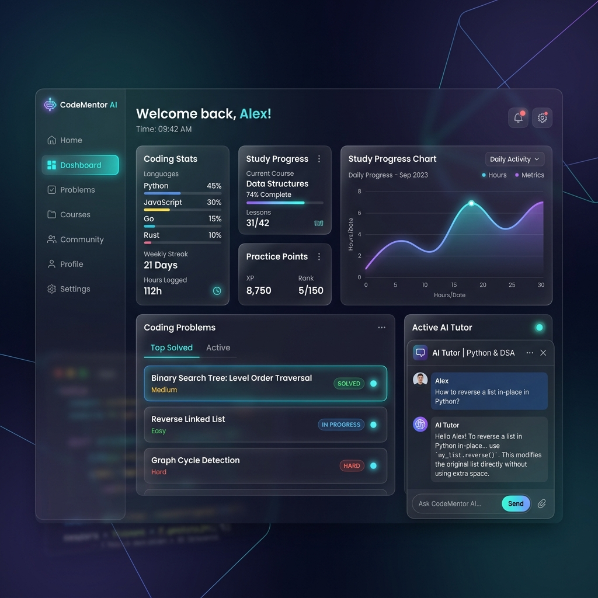
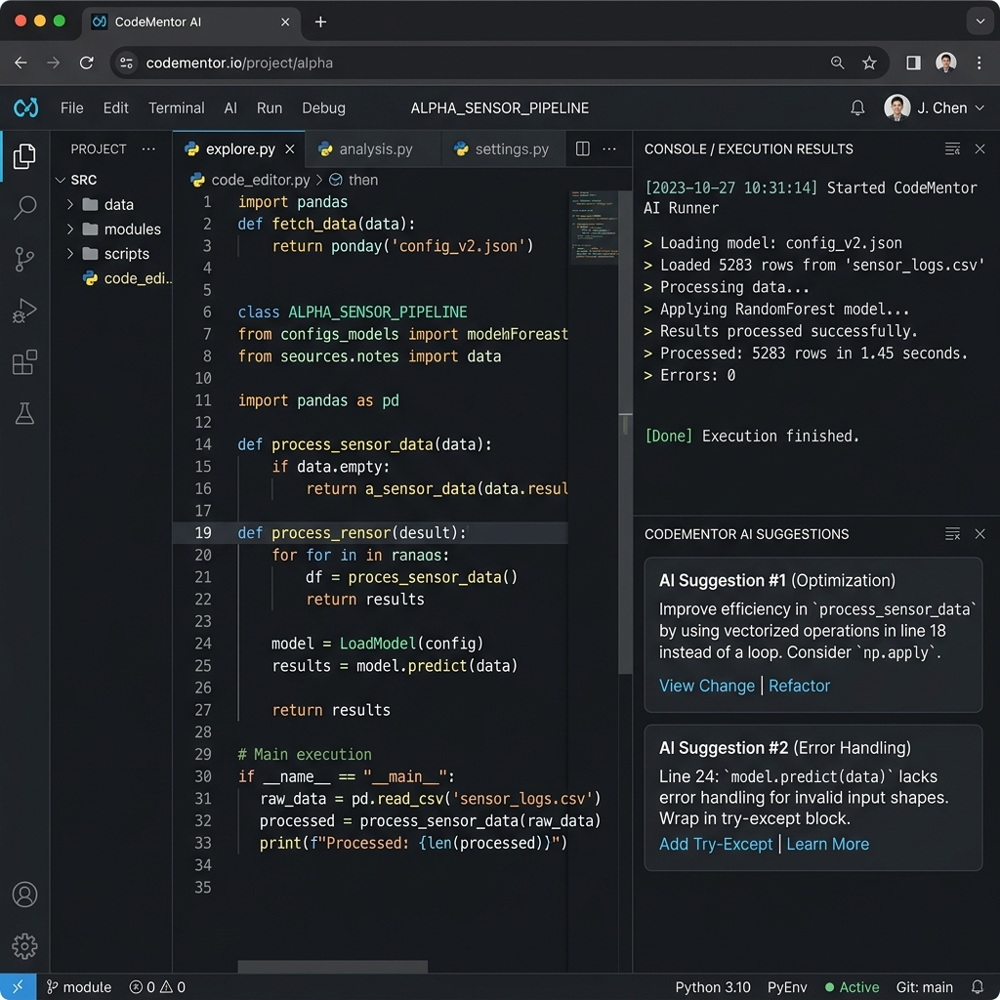

# CodeMentor AI

Track your coding progress, generate study plans, execute code online, and accelerate your learning journey — all in one platform.

[](https://flask.palletsprojects.com/)
[](https://python.org)
[](#)

---

## 📌 About the Project

**CodeMentor AI** is an advanced web-based coding assistant and progress tracker built using **Flask + Python**.  
It provides developers with:

- **AI-Powered Tutoring**: Ask concepts, get explanations, and walk through coding paradigms dynamically.
- **Spaced Repetition Flashcards**: Automatically generate revision decks on any topic using Google Gemini/OpenAI, and schedule them using a SuperMemo algorithm.
- **Code Execution Sandbox**: Safe, cross-platform isolated sandbox supporting real-time Python/C++ code compilation and automated test case runner.
- **Collaborative Study Groups**: Matches you with peers based on your target companies, goals, and coding progress.
- **Competitive Contests**: Admin-created coding challenges with leaderboards, runtime scoring, and visual podiums.

---

## 📸 Screenshots

### 📊 CodeMentor AI Dashboard


### 💻 Coding Workspace & Sandbox


---

## 🗂️ Project Structure

The project follows a standard Flask application factory architecture:

```text
CodeMentor AI/
│
├── app/
│   ├── __init__.py             # Flask application factory & database setup
│   ├── models.py               # Unified database models
│   ├── routes.py               # Controller routes (auth, dashboards, contests)
│   ├── ai/                     # AI abstraction layer (Gemini, Claude, OpenAI, DeepSeek)
│   ├── services/               # Core business services (code execution, notifications)
│   ├── static/                 # Front-end assets (consolidated CSS, JavaScript)
│   └── templates/              # HTML Templates
│
├── tests/                      # Testing package (34 tests with 80%+ coverage)
├── Dockerfile                  # Production container definition
├── docker-compose.yml          # Container configuration for local environments
├── .env.example                # Default configuration environment variables
├── Procfile                    # Production startup commands
├── render.yaml                 # Infrastructure-as-code deployment settings
├── main.py                     # Entrypoint script
└── README.md
```

---

## 🛠️ Installation & Setup

### 1️⃣ Clone the repository
```bash
git clone https://github.com/manojk909/CODE-TRACK-PRO.git
cd CODE-TRACK-PRO
```

### 2️⃣ Create & activate virtual environment
```bash
python -m venv venv
source venv/bin/activate        # macOS/Linux
venv\Scripts\activate           # Windows
```

### 3️⃣ Install dependencies
```bash
pip install -r render_requirements.txt
```

### 4️⃣ Set up environment variables
Copy the template configuration:
```bash
cp .env.example .env
```
Open `.env` and fill in your custom keys (e.g., `GEMINI_API_KEY`, `OPENAI_API_KEY`).

### 5️⃣ Seed local database
Create tables and populate sample problems:
```bash
python seed_db.py
```

### 6️⃣ Run the application
```bash
python main.py
```
Open **[http://localhost:5000](http://localhost:5000)** in your browser.

---

## 🚀 Deployment

CodeMentor AI is configured for one-click deployment via Render:
1. Log in to [Render](https://dashboard.render.com).
2. Click **New** -> **Blueprint**.
3. Link your GitHub repository.
4. Render will deploy the application and database based on `render.yaml`.
